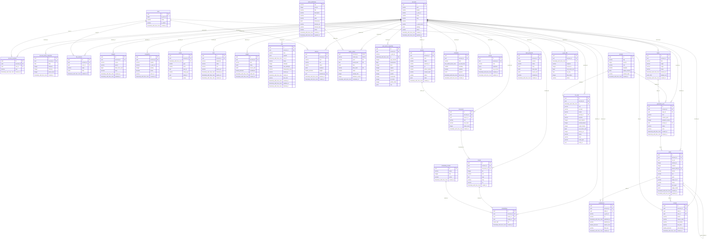

# ER-диаграмма

> Генерируется командой `make db-docs` из моделей (`xcopilot.db.docs`). Не редактировать вручную.

```mermaid
erDiagram
    account_members {
        uuid id PK
        uuid account_id FK
        uuid user_id FK
        varchar role
        timestamp_with_time_zone created_at
    }
    account_metric_snapshots {
        uuid id PK
        uuid account_id FK
        date date
        integer followers
        integer following
        integer posts_count
        timestamp_with_time_zone created_at
    }
    accounts {
        uuid id PK
        varchar kind
        varchar handle
        varchar x_user_id
        varchar niche
        varchar lang
        varchar tz
        varchar x_read_mode
        jsonb settings
        varchar status
        timestamp_with_time_zone created_at
        timestamp_with_time_zone updated_at
    }
    bot_sessions {
        uuid id PK
        uuid account_id FK
        uuid user_id FK
        varchar state
        jsonb data
        timestamp_with_time_zone updated_at
    }
    budgets {
        uuid id PK
        uuid account_id FK
        varchar scope
        varchar period
        bigint limit_micro_usd
        boolean hard
        timestamp_with_time_zone created_at
        timestamp_with_time_zone updated_at
    }
    chunks {
        uuid id PK
        uuid account_id FK
        uuid document_id FK
        integer idx
        varchar text
        text tags
        varchar lang
        tsvector tsv
        timestamp_with_time_zone created_at
    }
    competitors {
        uuid id PK
        uuid account_id FK
        varchar handle
        varchar x_user_id
        integer priority
        boolean active
        varchar since_id
        timestamp_with_time_zone created_at
    }
    documents {
        uuid id PK
        uuid account_id FK
        uuid source_id FK
        varchar text
        varchar text_clean
        integer token_count
        timestamp_with_time_zone created_at
    }
    drafts {
        uuid id PK
        uuid account_id FK
        uuid run_id FK
        integer variant_no
        integer revision
        uuid parent_draft_id FK
        varchar format
        varchar text
        jsonb parts
        varchar reply_to_url
        varchar status
        jsonb lint_report
        jsonb judge_verdict
        timestamp_with_time_zone created_at
        timestamp_with_time_zone updated_at
    }
    embedding_models {
        uuid id PK
        varchar name
        integer dim
        boolean active
        timestamp_with_time_zone created_at
    }
    embeddings {
        uuid id PK
        uuid account_id FK
        uuid chunk_id FK
        uuid model_id FK
        vector_384 vec
        timestamp_with_time_zone created_at
    }
    events {
        uuid id PK
        uuid account_id FK
        timestamp_with_time_zone ts PK
        varchar type
        varchar actor
        uuid user_id
        varchar entity_type
        uuid entity_id
        jsonb props
    }
    facts {
        uuid id PK
        uuid account_id FK
        varchar statement
        varchar value
        varchar unit
        varchar source_url
        timestamp_with_time_zone observed_at
        timestamp_with_time_zone expires_at
        timestamp_with_time_zone created_at
    }
    generation_runs {
        uuid id PK
        uuid account_id FK
        uuid topic_id FK
        varchar kind
        jsonb context_pack
        integer passport_version
        uuid prompt_id FK
        varchar status
        varchar error
        timestamp_with_time_zone created_at
        timestamp_with_time_zone finished_at
    }
    insights {
        uuid id PK
        uuid account_id FK
        varchar kind
        jsonb body
        jsonb source_refs
        double_precision confidence
        timestamp_with_time_zone valid_until
        timestamp_with_time_zone created_at
    }
    jobs {
        uuid id PK
        uuid account_id FK
        varchar kind
        jsonb payload
        timestamp_with_time_zone run_at
        varchar status
        integer attempts
        integer max_attempts
        varchar idempotency_key
        varchar locked_by
        timestamp_with_time_zone locked_at
        varchar last_error
        timestamp_with_time_zone created_at
        timestamp_with_time_zone updated_at
        timestamp_with_time_zone finished_at
    }
    lessons {
        uuid id PK
        uuid account_id FK
        varchar kind
        varchar text
        varchar status
        jsonb evidence
        double_precision weight
        uuid decided_by FK
        timestamp_with_time_zone decided_at
        timestamp_with_time_zone created_at
    }
    llm_calls {
        uuid id PK
        uuid account_id FK
        timestamp_with_time_zone ts PK
        varchar role
        varchar provider
        varchar model
        uuid prompt_id FK
        varchar purpose
        integer input_tokens
        integer cached_tokens
        integer output_tokens
        bigint cost_micro_usd
        integer latency_ms
        varchar status
        varchar error
        varchar entity_type
        uuid entity_id
    }
    metric_definitions {
        varchar key PK
        integer version
        varchar title
        varchar description
        varchar unit
        varchar grain
        jsonb dimensions
        varchar formula_sql
        varchar formula_hash
        boolean active
        timestamp_with_time_zone created_at
        timestamp_with_time_zone updated_at
    }
    metric_values {
        uuid account_id PK, FK
        varchar metric_key PK, FK
        varchar grain PK
        date period_start PK
        jsonb dims
        varchar dims_hash PK
        numeric value
        integer sample_size
        integer definition_version
        timestamp_with_time_zone computed_at
    }
    post_metric_snapshots {
        uuid id PK
        uuid account_id FK
        varchar x_post_id
        timestamp_with_time_zone ts PK
        integer age_minutes
        bigint impressions
        integer likes
        integer replies
        integer reposts
        integer quotes
        integer bookmarks
        integer url_clicks
        integer profile_clicks
        jsonb raw
    }
    prompts {
        uuid id PK
        varchar key
        integer version
        varchar role
        varchar template
        jsonb output_schema
        varchar content_hash
        timestamp_with_time_zone created_at
    }
    publications {
        uuid id PK
        uuid account_id FK
        uuid draft_id FK
        varchar x_post_id
        varchar url
        timestamp_with_time_zone published_at
        varchar matched_by
        double_precision match_score
        varchar final_text
        timestamp_with_time_zone created_at
    }
    reviews {
        uuid id PK
        uuid account_id FK
        uuid draft_id FK
        uuid user_id FK
        varchar action
        varchar reason_code
        varchar text_before
        varchar text_after
        double_precision edit_distance
        timestamp_with_time_zone created_at
    }
    schedules {
        uuid id PK
        uuid account_id FK
        varchar kind
        time_without_time_zone at_local_time
        smallint weekday
        boolean enabled
        jsonb payload
        timestamp_with_time_zone last_run_at
        timestamp_with_time_zone created_at
    }
    secrets {
        uuid id PK
        uuid account_id FK
        varchar kind
        bytea ciphertext
        integer key_version
        timestamp_with_time_zone created_at
        timestamp_with_time_zone updated_at
    }
    sources {
        uuid id PK
        uuid account_id FK
        varchar kind
        varchar origin
        varchar external_id
        varchar url
        varchar author_handle
        varchar content_hash
        varchar status
        jsonb meta
        timestamp_with_time_zone created_at
    }
    style_passports {
        uuid id PK
        uuid account_id FK
        integer version
        varchar status
        jsonb body
        jsonb hard_rules
        jsonb source_refs
        varchar created_by
        timestamp_with_time_zone created_at
    }
    topics {
        uuid id PK
        uuid account_id FK
        varchar title
        varchar angle
        varchar origin
        varchar status
        timestamp_with_time_zone planned_for
        vector_384 dedupe_vec
        timestamp_with_time_zone created_at
    }
    users {
        uuid id PK
        bigint tg_user_id
        varchar name
        boolean is_admin
        timestamp_with_time_zone created_at
    }
    x_api_calls {
        uuid id PK
        uuid account_id FK
        timestamp_with_time_zone ts PK
        varchar endpoint
        integer resources
        bigint cost_micro_usd
        date utc_day
        integer http_status
        varchar status
    }
    accounts ||--o{ account_members : "account_id"
    accounts ||--o{ account_metric_snapshots : "account_id"
    accounts ||--o{ bot_sessions : "account_id"
    accounts ||--o{ budgets : "account_id"
    accounts ||--o{ chunks : "account_id"
    accounts ||--o{ competitors : "account_id"
    accounts ||--o{ documents : "account_id"
    accounts ||--o{ drafts : "account_id"
    accounts ||--o{ embeddings : "account_id"
    accounts ||--o{ events : "account_id"
    accounts ||--o{ facts : "account_id"
    accounts ||--o{ generation_runs : "account_id"
    accounts ||--o{ insights : "account_id"
    accounts ||--o{ jobs : "account_id"
    accounts ||--o{ lessons : "account_id"
    accounts ||--o{ llm_calls : "account_id"
    accounts ||--o{ metric_values : "account_id"
    accounts ||--o{ post_metric_snapshots : "account_id"
    accounts ||--o{ publications : "account_id"
    accounts ||--o{ reviews : "account_id"
    accounts ||--o{ schedules : "account_id"
    accounts ||--o{ secrets : "account_id"
    accounts ||--o{ sources : "account_id"
    accounts ||--o{ style_passports : "account_id"
    accounts ||--o{ topics : "account_id"
    accounts ||--o{ x_api_calls : "account_id"
    chunks ||--o{ embeddings : "chunk_id"
    documents ||--o{ chunks : "document_id"
    drafts ||--o{ drafts : "parent_draft_id"
    drafts ||--o{ publications : "draft_id"
    drafts ||--o{ reviews : "draft_id"
    embedding_models ||--o{ embeddings : "model_id"
    generation_runs ||--o{ drafts : "run_id"
    metric_definitions ||--o{ metric_values : "metric_key"
    prompts ||--o{ generation_runs : "prompt_id"
    prompts ||--o{ llm_calls : "prompt_id"
    sources ||--o{ documents : "source_id"
    topics ||--o{ generation_runs : "topic_id"
    users ||--o{ account_members : "user_id"
    users ||--o{ bot_sessions : "user_id"
    users ||--o{ lessons : "decided_by"
    users ||--o{ reviews : "user_id"
```
